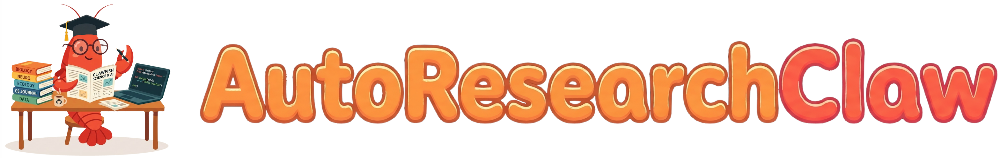
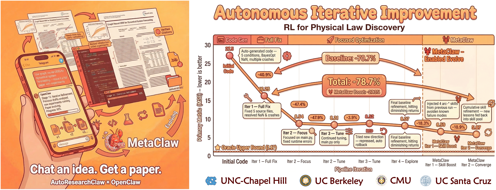
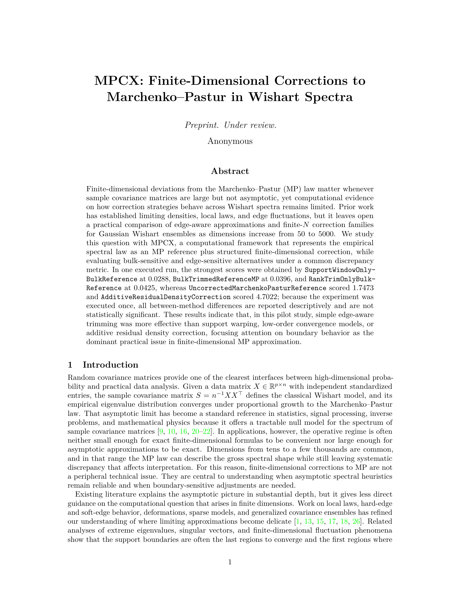

<p align="center">
  
</p>

<h2 align="center"><b>Расскажите идею. Получите статью. Полностью автономно & самоэволюционирующе.</b></h2>


<p align="center">
  <b><i><font size="5">Напишите <a href="#-интеграция-с-openclaw">OpenClaw</a>: «Исследуй X» → готово.</font></i></b>
</p>

<p align="center">
  
</p>


<p align="center">
  <a href="../LICENSE"></a>
  <a href="https://python.org"></a>
  <a href="#тестирование"></a>
  <a href="https://github.com/aiming-lab/AutoResearchClaw"></a>
  <a href="#-интеграция-с-openclaw"></a>
  <a href="https://discord.gg/u4ksqW5P"></a>
</p>

<p align="center">
  <a href="../README.md">🇺🇸 English</a> ·
  <a href="README_CN.md">🇨🇳 中文</a> ·
  <a href="README_JA.md">🇯🇵 日本語</a> ·
  <a href="README_KO.md">🇰🇷 한국어</a> ·
  <a href="README_FR.md">🇫🇷 Français</a> ·
  <a href="README_DE.md">🇩🇪 Deutsch</a> ·
  <a href="README_ES.md">🇪🇸 Español</a> ·
  <a href="README_PT.md">🇧🇷 Português</a> ·
  <a href="README_RU.md">🇷🇺 Русский</a> ·
  <a href="README_AR.md">🇸🇦 العربية</a>
</p>

<p align="center">
  <a href="showcase/SHOWCASE.md">🏆 Галерея статей</a> · <a href="integration-guide.md">📖 Руководство по интеграции</a> · <a href="https://discord.gg/u4ksqW5P">💬 Сообщество Discord</a>
</p>

---

<table>
<tr>
<td width="18%">
<a href="showcase/SHOWCASE.md"></a>
</td>
<td valign="middle">
<b>🏆 Галерея сгенерированных статей</b><br><br>
<b>8 статей в 8 областях</b> — математика, статистика, биология, информатика, NLP, RL, компьютерное зрение, робастность — сгенерированы полностью автономно без вмешательства человека.<br><br>
<a href="showcase/SHOWCASE.md"></a>
</td>
</tr>
</table>

---

> **🧪 Мы ищем тестировщиков!** Попробуйте конвейер с вашей собственной исследовательской идеей — из любой области — и [расскажите нам, что думаете](TESTER_GUIDE.md). Ваша обратная связь напрямую формирует следующую версию. **[→ Testing Guide](TESTER_GUIDE.md)** | **[→ 中文测试指南](TESTER_GUIDE_CN.md)** | **[→ 日本語テストガイド](TESTER_GUIDE_JA.md)**

---

## 🔥 News
- **[03/18/2026]** [v0.3.1](https://github.com/aiming-lab/AutoResearchClaw/releases/tag/v0.3.1) — **OpenCode Beast Mode + Community Contributions** — New "Beast Mode" routes complex code generation to [OpenCode](https://github.com/anomalyco/opencode) with automatic complexity scoring and graceful fallback. Added Novita AI provider support, thread-safety hardening, improved LLM output parsing robustness, and 20+ bug fixes from community PRs and internal audit.
- **[03/17/2026]** [v0.3.0](https://github.com/aiming-lab/AutoResearchClaw/releases/tag/v0.3.0) — **MetaClaw Integration** — AutoResearchClaw now supports [MetaClaw](https://github.com/aiming-lab/MetaClaw) cross-run learning: pipeline failures → structured lessons → reusable skills, injected into all 23 stages. **+18.3%** robustness in controlled experiments. Opt-in (`metaclaw_bridge.enabled: true`), fully backward-compatible. See [Integration Guide](#-metaclaw-integration).
- **[03/16/2026]** [v0.2.0](https://github.com/aiming-lab/AutoResearchClaw/releases/tag/v0.2.0) — Three multi-agent subsystems (CodeAgent, BenchmarkAgent, FigureAgent), hardened Docker sandbox with network-policy-aware execution, 4-round paper quality audit (AI-slop detection, 7-dim review scoring, NeurIPS checklist), and 15+ bug fixes from production runs.
- **[03/15/2026]** [v0.1.0](https://github.com/aiming-lab/AutoResearchClaw/releases/tag/v0.1.0) — We release AutoResearchClaw: a fully autonomous 23-stage research pipeline that turns a single research idea into a conference-ready paper. No human intervention required.

---

## ⚡ Одна команда. Одна статья.

```bash
pip install -e . && researchclaw setup && researchclaw init && researchclaw run --topic "Your research idea here" --auto-approve
```


---

## 🤔 Что это такое?

**Вы думаете. AutoResearchClaw пишет.**

Задайте исследовательскую тему — получите полноценную академическую статью с реальной литературой из OpenAlex, Semantic Scholar и arXiv, аппаратно-адаптивными песочными экспериментами (автоопределение GPU/MPS/CPU), статистическим анализом, мультиагентным рецензированием и готовым для конференции LaTeX для NeurIPS/ICML/ICLR. Без ручного контроля. Без копирования. Без галлюцинированных ссылок.

<table>
<tr><td>📄</td><td><code>paper_draft.md</code></td><td>Полная академическая статья (Введение, Обзор литературы, Метод, Эксперименты, Результаты, Заключение)</td></tr>
<tr><td>📐</td><td><code>paper.tex</code></td><td>Готовый для конференции LaTeX (шаблоны NeurIPS / ICLR / ICML)</td></tr>
<tr><td>📚</td><td><code>references.bib</code></td><td>Реальные BibTeX-ссылки из OpenAlex, Semantic Scholar и arXiv — автоматическая очистка для соответствия встроенным цитатам</td></tr>
<tr><td>🔍</td><td><code>verification_report.json</code></td><td>4-уровневая верификация целостности и релевантности цитирования (arXiv, CrossRef, DataCite, LLM)</td></tr>
<tr><td>🧪</td><td><code>experiment runs/</code></td><td>Сгенерированный код + результаты песочницы + структурированные JSON-метрики</td></tr>
<tr><td>📊</td><td><code>charts/</code></td><td>Автоматически сгенерированные сравнительные графики с полосами ошибок и доверительными интервалами</td></tr>
<tr><td>📝</td><td><code>reviews.md</code></td><td>Мультиагентное рецензирование с проверкой согласованности методологии и результатов</td></tr>
<tr><td>🧬</td><td><code>evolution/</code></td><td>Уроки для самообучения, извлечённые из каждого запуска</td></tr>
<tr><td>📦</td><td><code>deliverables/</code></td><td>Все итоговые материалы в одной папке — готовы к компиляции в Overleaf</td></tr>
</table>

Конвейер работает **полностью автономно без вмешательства человека**. Когда эксперименты завершаются ошибкой — система восстанавливается автоматически. Когда гипотезы не подтверждаются — она меняет направление. Когда цитаты оказываются поддельными — она их удаляет.

---

## 🚀 Быстрый старт

```bash
# 1. Клонируйте и установите
git clone https://github.com/aiming-lab/AutoResearchClaw.git
cd AutoResearchClaw
python3 -m venv .venv && source .venv/bin/activate
pip install -e .

# 2. Настройка (интерактивная — устанавливает OpenCode beast mode, проверяет Docker/LaTeX)
researchclaw setup

# 3. Конфигурация
researchclaw init          # Интерактивный: выбор провайдера LLM, создание config.arc.yaml
# Или вручную: cp config.researchclaw.example.yaml config.arc.yaml

# 4. Запуск
export OPENAI_API_KEY="sk-..."
researchclaw run --config config.arc.yaml --topic "Your research idea" --auto-approve
```

Результаты → `artifacts/rc-YYYYMMDD-HHMMSS-<hash>/deliverables/` — готовые к компиляции LaTeX, BibTeX, код экспериментов, графики.

<details>
<summary>📝 Минимальная необходимая конфигурация</summary>

```yaml
project:
  name: "my-research"

research:
  topic: "Your research topic here"

llm:
  base_url: "https://api.openai.com/v1"
  api_key_env: "OPENAI_API_KEY"
  primary_model: "gpt-4o"
  fallback_models: ["gpt-4o-mini"]

experiment:
  mode: "sandbox"
  sandbox:
    python_path: ".venv/bin/python"
```

</details>

---

## 🧠 Чем он отличается

| Возможность | Как это работает |
|-----------|-------------|
| **🔄 Цикл PIVOT / REFINE** | Этап 15 автономно решает: PROCEED, REFINE (подстройка параметров) или PIVOT (новое направление). Артефакты автоматически версионируются. |
| **🤖 Мультиагентная дискуссия** | Генерация гипотез, анализ результатов и рецензирование используют структурированную дискуссию с множеством точек зрения. |
| **🧬 Самообучение** | Уроки извлекаются из каждого запуска (обоснование решений, предупреждения runtime, аномалии метрик) с временным затуханием 30 дней. Будущие запуски учатся на прошлых ошибках. |
| **📚 База знаний** | Каждый запуск формирует структурированную БЗ с 6 категориями (решения, эксперименты, открытия, литература, вопросы, рецензии). |
| **🛡️ Сторожевой модуль Sentinel** | Фоновый монитор качества: обнаружение NaN/Inf, согласованность статьи и доказательств, оценка релевантности цитирования, защита от фабрикации. |

---

## 🦞 Интеграция с OpenClaw

<table>
<tr>

**AutoResearchClaw — это сервис, совместимый с [OpenClaw](https://github.com/openclaw/openclaw).** Установите его в OpenClaw и запускайте автономные исследования одним сообщением — или используйте автономно через CLI, Claude Code или любой AI-ассистент для программирования.

</tr>
</table>

### 🚀 Использование с OpenClaw (рекомендуется)

Если вы уже используете [OpenClaw](https://github.com/openclaw/openclaw) в качестве AI-ассистента:

```
1️⃣  Поделитесь URL репозитория GitHub с OpenClaw
2️⃣  OpenClaw автоматически читает RESEARCHCLAW_AGENTS.md → понимает конвейер
3️⃣  Скажите: "Research [ваша тема]"
4️⃣  Готово — OpenClaw клонирует, устанавливает, настраивает, запускает и возвращает результаты
```

**Вот и всё.** OpenClaw автоматически выполняет `git clone`, `pip install`, настройку конфигурации и запуск конвейера. Вы просто общаетесь в чате.

<details>
<summary>💡 Что происходит «под капотом»</summary>

1. OpenClaw читает `RESEARCHCLAW_AGENTS.md` → узнаёт роль исследовательского оркестратора
2. OpenClaw читает `README.md` → понимает установку и структуру конвейера
3. OpenClaw копирует `config.researchclaw.example.yaml` → `config.yaml`
4. Запрашивает ваш API-ключ LLM (или использует переменную окружения)
5. Выполняет `pip install -e .` + `researchclaw run --topic "..." --auto-approve`
6. Возвращает статью, LaTeX, эксперименты и цитаты

</details>

### 🔌 Мост OpenClaw (продвинутое использование)

Для более глубокой интеграции AutoResearchClaw включает **систему мостовых адаптеров** с 6 опциональными возможностями:

```yaml
# config.arc.yaml
openclaw_bridge:
  use_cron: true              # ⏰ Запуск исследований по расписанию
  use_message: true           # 💬 Уведомления о прогрессе (Discord/Slack/Telegram)
  use_memory: true            # 🧠 Межсессионное сохранение знаний
  use_sessions_spawn: true    # 🔀 Параллельные подсессии для одновременных этапов
  use_web_fetch: true         # 🌐 Веб-поиск в реальном времени при обзоре литературы
  use_browser: false          # 🖥️ Сбор статей через браузер
```

Каждый флаг активирует типизированный протокол адаптера. Когда OpenClaw предоставляет эти возможности, адаптеры используют их без изменений в коде. Подробности см. в [`integration-guide.md`](integration-guide.md).

### ACP (Agent Client Protocol)

AutoResearchClaw может использовать **любой ACP-совместимый агент для программирования** в качестве LLM-бэкенда — без необходимости в API-ключах. Агент взаимодействует через [acpx](https://github.com/openclaw/acpx), поддерживая единую постоянную сессию на протяжении всех 23 этапов конвейера.

| Агент | Команда | Примечания |
|-------|---------|------------|
| Claude Code | `claude` | Anthropic |
| Codex CLI | `codex` | OpenAI |
| Copilot CLI | `gh` | GitHub |
| Gemini CLI | `gemini` | Google |
| OpenCode | `opencode` | SST |
| Kimi CLI | `kimi` | Moonshot |

```yaml
# config.yaml — пример ACP
llm:
  provider: "acp"
  acp:
    agent: "claude"   # Любая команда CLI ACP-совместимого агента
    cwd: "."          # Рабочий каталог для агента
  # Не нужны base_url или api_key — агент управляет собственной авторизацией.
```

```bash
# Просто запускайте — агент использует собственные учётные данные
researchclaw run --config config.yaml --topic "Your research idea" --auto-approve
```

### 🛠️ Другие способы запуска

| Способ | Как |
|--------|-----|
| **Автономный CLI** | `researchclaw setup` → `researchclaw init` → `researchclaw run --topic "..." --auto-approve` |
| **Python API** | `from researchclaw.pipeline import Runner; Runner(config).run()` |
| **Claude Code** | Читает `RESEARCHCLAW_CLAUDE.md` — просто скажите *«Проведи исследование по [теме]»* |
| **Copilot CLI** | `researchclaw run --topic "..."` с `llm.acp.agent: "gh"` |
| **OpenCode** | Читает `.claude/skills/` — тот же интерфейс на естественном языке |
| **Любой AI CLI** | Предоставьте `RESEARCHCLAW_AGENTS.md` как контекст → агент автоматически загружается |

---

## 🔬 Конвейер: 23 этапа, 8 фаз

```
Фаза A: Определение области          Фаза E: Выполнение экспериментов
  1. TOPIC_INIT                         12. EXPERIMENT_RUN
  2. PROBLEM_DECOMPOSE                  13. ITERATIVE_REFINE  ← самовосстановление

Фаза B: Поиск литературы             Фаза F: Анализ и решение
  3. SEARCH_STRATEGY                    14. RESULT_ANALYSIS    ← мультиагентный
  4. LITERATURE_COLLECT  ← реальный API 15. RESEARCH_DECISION  ← PIVOT/REFINE
  5. LITERATURE_SCREEN   [контроль]
  6. KNOWLEDGE_EXTRACT                  Фаза G: Написание статьи
                                        16. PAPER_OUTLINE
Фаза C: Синтез знаний                  17. PAPER_DRAFT
  7. SYNTHESIS                          18. PEER_REVIEW        ← проверка доказательств
  8. HYPOTHESIS_GEN    ← дискуссия      19. PAPER_REVISION

Фаза D: Проектирование экспериментов Фаза H: Финализация
  9. EXPERIMENT_DESIGN   [контроль]     20. QUALITY_GATE      [контроль]
 10. CODE_GENERATION                    21. KNOWLEDGE_ARCHIVE
 11. RESOURCE_PLANNING                  22. EXPORT_PUBLISH     ← LaTeX
                                        23. CITATION_VERIFY    ← проверка релевантности
```

> **Контрольные этапы** (5, 9, 20) приостанавливают работу для подтверждения человеком или пропускаются с `--auto-approve`. При отклонении конвейер откатывается назад.

> **Циклы принятия решений**: Этап 15 может запустить REFINE (→ Этап 13) или PIVOT (→ Этап 8) с автоматическим версионированием артефактов.

<details>
<summary>📋 Что делает каждая фаза</summary>

| Фаза | Что происходит |
|------|---------------|
| **A: Определение области** | LLM декомпозирует тему в структурированное дерево задач с исследовательскими вопросами |
| **A+: Аппаратное обеспечение** | Автоопределение GPU (NVIDIA CUDA / Apple MPS / только CPU), предупреждение при ограниченных ресурсах, адаптация генерации кода |
| **B: Литература** | Мультиисточниковый поиск (OpenAlex → Semantic Scholar → arXiv) реальных статей, скрининг по релевантности, извлечение карточек знаний |
| **C: Синтез** | Кластеризация находок, выявление пробелов в исследованиях, генерация проверяемых гипотез через мультиагентную дискуссию |
| **D: Проектирование** | Проектирование плана эксперимента, генерация аппаратно-адаптивного исполняемого Python-кода (уровень GPU → выбор пакетов), оценка потребности в ресурсах |
| **E: Выполнение** | Запуск экспериментов в песочнице, обнаружение NaN/Inf и ошибок времени выполнения, самовосстановление кода через целенаправленное исправление LLM |
| **F: Анализ** | Мультиагентный анализ результатов; автономное решение PROCEED / REFINE / PIVOT с обоснованием |
| **G: Написание** | План → посекционное написание (5 000–6 500 слов) → рецензирование (с проверкой согласованности методологии и доказательств) → ревизия с контролем объёма |
| **H: Финализация** | Контроль качества, архивирование знаний, экспорт LaTeX с конференционным шаблоном, верификация целостности и релевантности цитирования |

</details>

---

## ✨ Ключевые возможности

| Возможность | Описание |
|---------|------------|
| **📚 Мультиисточниковая литература** | Реальные статьи из OpenAlex, Semantic Scholar и arXiv — расширение запросов, дедупликация, автоматический выключатель с постепенной деградацией |
| **🔍 4-уровневая верификация цитирования** | Проверка arXiv ID → CrossRef/DataCite DOI → сопоставление названий в Semantic Scholar → оценка релевантности LLM. Галлюцинированные ссылки удаляются автоматически. |
| **🖥️ Аппаратно-адаптивное выполнение** | Автоопределение GPU (NVIDIA CUDA / Apple MPS / только CPU) с адаптацией генерации кода, импортов и масштаба экспериментов |
| **🦾 OpenCode Beast Mode** | Сложные эксперименты автоматически маршрутизируются в [OpenCode](https://github.com/anomalyco/opencode) — генерация многофайловых проектов с пользовательскими архитектурами, циклами обучения и исследованиями абляции. Установка через `researchclaw setup`. |
| **🧪 Песочные эксперименты** | AST-валидированный код, неизменяемая обвязка, быстрый отказ при NaN/Inf, самовосстанавливающееся исправление, итеративное улучшение (до 10 раундов), захват частичных результатов |
| **📝 Написание конференционного уровня** | Шаблоны NeurIPS/ICML/ICLR, посекционное написание (5 000–6 500 слов), защита от фабрикации, контроль объёма ревизии, подавление оговорок |
| **📐 Переключение шаблонов** | `neurips_2025`, `iclr_2026`, `icml_2026` — Markdown → LaTeX с математикой, таблицами, рисунками, перекрёстными ссылками, `\cite{}` |
| **🚦 Контрольные этапы** | 3 этапа с человеком в цикле (этапы 5, 9, 20) с откатом. Пропуск с `--auto-approve`. |

---

## 🧠 Интеграция с MetaClaw

**AutoResearchClaw + [MetaClaw](https://github.com/aiming-lab/MetaClaw) = Конвейер, который учится на каждом запуске.**

MetaClaw добавляет **межзапусковый перенос знаний** в AutoResearchClaw. При включении конвейер автоматически фиксирует уроки из сбоев и предупреждений, преобразует их в переиспользуемые навыки и внедряет эти навыки во все 23 этапа конвейера при последующих запусках — чтобы одни и те же ошибки никогда не повторялись.

### Как это работает

```
Run N выполняется → сбои/предупреждения фиксируются как Lessons
                      ↓
          MetaClaw Lesson → преобразование в Skill
                      ↓
          Файлы arc-* Skill сохраняются в ~/.metaclaw/skills/
                      ↓
Run N+1 → build_overlay() внедряет навыки в каждый LLM-промпт
                      ↓
          LLM избегает известных подводных камней → выше качество, меньше повторов
```

### Быстрая настройка

```bash
# 1. Установите MetaClaw (если ещё не установлен)
pip install metaclaw

# 2. Включите в вашей конфигурации
```

```yaml
# config.arc.yaml
metaclaw_bridge:
  enabled: true
  proxy_url: "http://localhost:30000"        # Прокси MetaClaw (опционально)
  skills_dir: "~/.metaclaw/skills"          # Где хранятся навыки
  fallback_url: "https://api.openai.com/v1" # Прямой LLM-откат
  fallback_api_key: ""                      # API-ключ для URL отката
  lesson_to_skill:
    enabled: true
    min_severity: "warning"                 # Конвертировать warnings + errors
    max_skills_per_run: 3
```

```bash
# 3. Запускайте как обычно — MetaClaw работает прозрачно
researchclaw run --config config.arc.yaml --topic "Your idea" --auto-approve
```

После каждого запуска проверьте `~/.metaclaw/skills/arc-*/SKILL.md`, чтобы увидеть навыки, которые ваш конвейер освоил.

### Результаты экспериментов

В контролируемых A/B экспериментах (одна тема, одна LLM, одна конфигурация):

| Метрика | Базовая линия | С MetaClaw | Улучшение |
|---------|--------------|------------|-----------|
| Частота повторов на этапе | 10.5% | 7.9% | **-24.8%** |
| Количество циклов REFINE | 2.0 | 1.2 | **-40.0%** |
| Завершённость этапов конвейера | 18/19 | 19/19 | **+5.3%** |
| Общая оценка робастности (композитная) | 0.714 | 0.845 | **+18.3%** |

> Композитная оценка робастности — взвешенное среднее из доли завершённых этапов (40%), снижения повторов (30%) и эффективности циклов REFINE (30%).

### Обратная совместимость

- **По умолчанию: ВЫКЛЮЧЕНО.** Если `metaclaw_bridge` отсутствует или `enabled: false`, конвейер работает точно как раньше.
- **Без новых зависимостей.** MetaClaw опционален — основной конвейер работает без него.
- **Все 1 634 существующих теста проходят** при наличии кода интеграции.

---

## ⚙️ Справочник по конфигурации

<details>
<summary>Нажмите для раскрытия полного справочника по конфигурации</summary>

```yaml
# === Проект ===
project:
  name: "my-research"              # Идентификатор проекта
  mode: "docs-first"               # docs-first | semi-auto | full-auto

# === Исследование ===
research:
  topic: "..."                     # Тема исследования (обязательно)
  domains: ["ml", "nlp"]           # Предметные области для поиска литературы
  daily_paper_count: 8             # Целевое число статей на поисковый запрос
  quality_threshold: 4.0           # Минимальный балл качества статей

# === Среда выполнения ===
runtime:
  timezone: "America/New_York"     # Для временных меток
  max_parallel_tasks: 3            # Лимит параллельных экспериментов
  approval_timeout_hours: 12       # Таймаут контрольного этапа
  retry_limit: 2                   # Число повторных попыток при сбое этапа

# === LLM ===
llm:
  provider: "openai-compatible"    # openai | openrouter | deepseek | minimax | acp | openai-compatible
  base_url: "https://..."          # Конечная точка API (обязательно для openai-compatible)
  api_key_env: "OPENAI_API_KEY"    # Переменная окружения для API-ключа (обязательно для openai-compatible)
  api_key: ""                      # Или укажите ключ здесь напрямую
  primary_model: "gpt-4o"          # Основная модель
  fallback_models: ["gpt-4o-mini"] # Резервная цепочка
  s2_api_key: ""                   # API-ключ Semantic Scholar (опционально, повышенные лимиты)
  acp:                             # Используется только при provider: "acp"
    agent: "claude"                # Команда CLI ACP-агента (claude, codex, gemini и т.д.)
    cwd: "."                       # Рабочий каталог для агента

# === Эксперименты ===
experiment:
  mode: "sandbox"                  # simulated | sandbox | docker | ssh_remote
  time_budget_sec: 300             # Макс. время выполнения за запуск (по умолчанию: 300 с)
  max_iterations: 10               # Макс. число итераций оптимизации
  metric_key: "val_loss"           # Имя основной метрики
  metric_direction: "minimize"     # minimize | maximize
  sandbox:
    python_path: ".venv/bin/python"
    gpu_required: false
    allowed_imports: [math, random, json, csv, numpy, torch, sklearn]
    max_memory_mb: 4096
  docker:
    image: "researchclaw/experiment:latest"
    network_policy: "setup_only"   # none | setup_only | pip_only | full
    gpu_enabled: true
    memory_limit_mb: 8192
    auto_install_deps: true        # Автоопределение импортов → requirements.txt
  ssh_remote:
    host: ""                       # Имя хоста GPU-сервера
    gpu_ids: []                    # Доступные идентификаторы GPU
    remote_workdir: "/tmp/researchclaw_experiments"
  opencode:                          # OpenCode Beast Mode (автоустановка через `researchclaw setup`)
    enabled: true                    # Главный переключатель (по умолчанию: true)
    auto: true                       # Автозапуск без подтверждения (по умолчанию: true)
    complexity_threshold: 0.2        # 0.0-1.0 — выше = запускать только на сложных экспериментах
    model: ""                        # Переопределение модели (пусто = использовать llm.primary_model)
    timeout_sec: 600                 # Макс. секунд для генерации OpenCode
    max_retries: 1                   # Число повторных попыток при сбое
    workspace_cleanup: true          # Удалить временное рабочее пространство после сбора

# === Экспорт ===
export:
  target_conference: "neurips_2025"  # neurips_2025 | iclr_2026 | icml_2026
  authors: "Anonymous"
  bib_file: "references"

# === Промпты ===
prompts:
  custom_file: ""                  # Путь к пользовательскому YAML промптов (пусто = по умолчанию)

# === Безопасность ===
security:
  hitl_required_stages: [5, 9, 20] # Этапы, требующие подтверждения человека
  allow_publish_without_approval: false
  redact_sensitive_logs: true

# === База знаний ===
knowledge_base:
  backend: "markdown"              # markdown | obsidian
  root: "docs/kb"

# === Уведомления ===
notifications:
  channel: "console"               # console | discord | slack
  target: ""

# === MetaClaw Bridge (Опционально) ===
metaclaw_bridge:
  enabled: false                   # Установите true для включения межзапускового обучения
  proxy_url: "http://localhost:30000"  # URL прокси MetaClaw
  skills_dir: "~/.metaclaw/skills" # Где хранятся навыки arc-*
  fallback_url: ""                 # Прямой LLM-откат при недоступности прокси
  fallback_api_key: ""             # API-ключ для конечной точки отката
  lesson_to_skill:
    enabled: true                  # Автоконвертация уроков в навыки
    min_severity: "warning"        # Минимальная серьёзность для конвертации
    max_skills_per_run: 3          # Макс. новых навыков за запуск конвейера

# === Мост OpenClaw ===
openclaw_bridge:
  use_cron: false                  # Запуск исследований по расписанию
  use_message: false               # Уведомления о прогрессе
  use_memory: false                # Межсессионное сохранение знаний
  use_sessions_spawn: false        # Параллельные подсессии
  use_web_fetch: false             # Веб-поиск в реальном времени
  use_browser: false               # Сбор статей через браузер
```

</details>

---

## 🙏 Благодарности

Вдохновлено проектами:

- 🔬 [AI Scientist](https://github.com/SakanaAI/AI-Scientist) (Sakana AI) — Пионер автоматизированных исследований
- 🧠 [AutoResearch](https://github.com/karpathy/autoresearch) (Andrej Karpathy) — Сквозная автоматизация исследований
- 🌐 [FARS](https://analemma.ai/blog/introducing-fars/) (Analemma) — Полностью автоматизированная исследовательская система

---

## 📄 Лицензия

MIT — подробности в [LICENSE](../LICENSE).

---

## 📌 Цитирование

Если AutoResearchClaw оказался вам полезен, пожалуйста, процитируйте:

```bibtex
@misc{liu2026autoresearchclaw,
  author       = {Liu, Jiaqi and Xia, Peng and Han, Siwei and Qiu, Shi and Zhang, Letian and Chen, Guiming  and Tu, Haoqin and Yang, Xinyu and and Zhou, Jiawei and Zhu, Hongtu and Li, Yun and Zhou, Yuyin and Zheng, Zeyu and Xie, Cihang and Ding, Mingyu and Yao, Huaxiu},
  title        = {AutoResearchClaw: Fully Autonomous Research from Idea to Paper},
  year         = {2026},
  organization = {GitHub},
  url          = {https://github.com/aiming-lab/AutoResearchClaw},
}
```

<p align="center">
  <sub>Создано с 🦞 командой AutoResearchClaw</sub>
</p>
